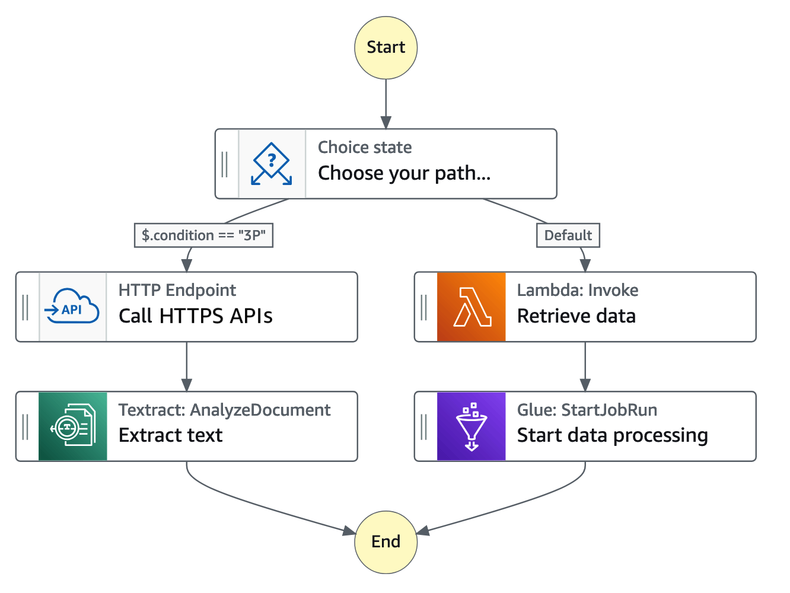

# ConhecimentoStepFunction
Desafio 2 do Curso Code Girls

#Step Function

* Orquestrador de serviços da AWS.
* Construtor visual para criar fluxos de trabalho (workflows).
* Esses fluxos de trabalho são visuais.
* Low Code.
* Construtor de rotinas.
* Pode ser usado para validar serviços.
* Coordena componentes de aplicativos e microsserviços distribuídos através de fluxos de trabalho visuais.
* Gerencia estado e erros.
* Visualizar, editar e depurar o fluxo de trabalho da aplicação.
* Me lembra muito um fluxograma de processos.
* Existem exemplos para ser explorados e utilizados.
* Quando você cria o workflow, os serviços são criados automaticamente.

Fonte: Documentação AWS

## Tipos de fluxos de trabalho:

### Fluxos de trabalho padrão:
* São ideais para fluxos de trabalho auditáveis e de longa duração, pois mostram o histórico de execução e a depuração visual.

### Fluxos de trabalho expresso:
* São ideais para high-event-rate cargas de trabalho, como processamento de dados de streaming e ingestão de dados de IoT.

